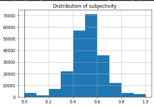
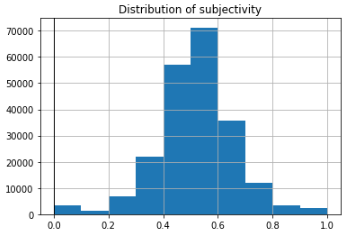
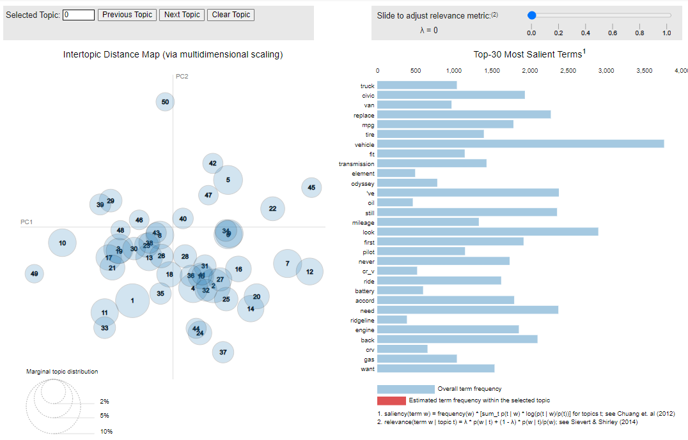

# Pablo's Data Science Portfolio
Data Science Projects

Hello there and welcome to my highlight reel for projects! 

## Project 1: [Data Science NLP LDA Model: Project Overview](https://github.com/pescoto0325/Pablo_Portfolio/blob/main/NLP%20LDA%20Model)
Texts have become one of the most ubiquitous forms of marketing data in the digital economy. Perhaps nowhere is this more salient than in the online reviews domain. In this module, we examined how natural language processing (NLP) techniques can be applied to Honda car reviews. This [dataset](https://www.kaggle.com/datasets/ankkur13/edmundsconsumer-car-ratings-and-reviews) is available in Kaggle and requires some cleansing and preparation beforehand.

Questions to answer:
* Are the reviews usually fact or opinion based?
* What are some topics to think when buying a Honda vehicle?
* Are the topics correlating with the ratings?

 

## Project 2: [Regression Analysis: Price per stat Model](https://github.com/pescoto0325/Pablo_Portfolio/blob/main/Price%20per%20stat%20Model)
Why are the bests players in real life not the most expensive players in the game?
In this analysis,  linear and logistic regression are used to understand the relationship between stats and in game price for all the players. The [dataset](https://www.kaggle.com/datasets/mohammedessam97/fifa-22-fut-players-dataset) shows the stats and in-game price for players in FIFA 22.

Questions to answer:
* What stats have a higher impact on a players price?
* Is this relationship the same for all positions?
* Is there a clear winner across all of the stats?

