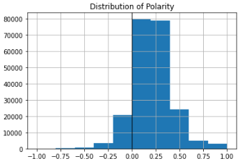

# Pablo's Data Science Portfolio
Data Science Projects

Hello there and welcome to my highlight reel for projects! 

## Project 1: [Predictive Analytics: Creating a Recommender system using Singular Value Decomposition](https://github.com/pescoto0325/Pablo_Portfolio/blob/main/Pablo_Escoto_A12_Predictive_Analytics.ipynb)

In this exercise, we will get some hands on experience at building a product recommender system using collaborative filtering. In particular, we will implement Singular Value Decomposition. Using python, we would get an algorithm to suggest restaurants to user's based on their previous visits but also using restaurants that host similar clients. We are going to do so by using ratings as our numerical value attaching 1 restaurant and 1 user to each review. To prevent fake reviews we will only use 1 review per user per restaurant.

Questions this project answers:
* What restaurants are similar/competitive to each other?
* What kind of people go to a specific restaurant?
* Is there a pattern between the restaurant or the client experience? (Are users too kind or is the place actually good)

![][(Yelp.png)

Going to using over 208166 reviews from users and 10233 ratings from restaurants using Yelp's API dataset

There are 3 types of recommender algorithms (user-based, item-based, model-based) we are going to user the 3rd one)

 

Here is a singular review in rating and how we are going to predict the rating for a restaurant, hence recommending it to a client.

## Project 2: [Regression Analysis: Price per stat Model](https://github.com/pescoto0325/Pablo_Portfolio/blob/main/Price%20per%20stat%20Model)
Why are the bests players in real life not the most expensive players in the game?
In this analysis,  linear and logistic regression are used to understand the relationship between stats and in game price for all the players. The [dataset](https://www.kaggle.com/datasets/mohammedessam97/fifa-22-fut-players-dataset) shows the stats and in-game price for players in FIFA 22.

Questions this project answers:
* What stats have a higher impact on a players price?
* Is this relationship the same for all positions?
* Is there a clear winner across all of the stats?

## Project 3: [Data Science NLP LDA Model: Project Overview](https://github.com/pescoto0325/Pablo_Portfolio/blob/main/NLP%20LDA%20Model)
Texts have become one of the most ubiquitous forms of marketing data in the digital economy. Perhaps nowhere is this more salient than in the online reviews domain. In this module, we examined how natural language processing (NLP) techniques can be applied to Honda car reviews. This [dataset](https://www.kaggle.com/datasets/ankkur13/edmundsconsumer-car-ratings-and-reviews) is available in Kaggle and requires some cleansing and preparation beforehand.

Questions this project answers:
* Are the reviews usually fact or opinion based?
* What are some topics to think when buying a Honda vehicle?
* Are the topics correlating with the ratings?

 

Based on our dataset, most of the reviews show a positive take. (0 = bad, 1 = good)

Based on our dataset, most of our reviews fact-based as we can see higher subjectivity. (0 = opinion, 1 = fact)

Here is a look at all the topics in our reviews, we can see how the word vehicle is the most used word (we are talking about cars) and how the Honda Odissey seems to be their their most spoken model.

## Project 4: [Conjoint Analysis: Feature importance in a product](https://github.com/pescoto0325/Pablo_Portfolio/blob/main/Conjoint%20Analysis)
Analysis which provides statistical evidence on which feature has a greater impact in ratings.

Using a [dataset](https://github.com/pescoto0325/Pablo_Portfolio/blob/main/motorbike_conjoint.csv) from a survey of motorcycles we dissect the importance of features in a product to understand what is best for the client. To do this, we use a hierarchical linear model (HLM) that estimates both the overall fixed effect and the individual level random effect.

Questions this project answers:
* What is the relative importance of a feature in a product?
* Which combination provides a better rating?
* How many different products can be made from a defined set of features?

 
